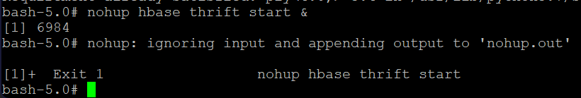

# Project Summary

## Implementation Overview

Summarize the end-to-end project in your own words.

Describe the dataset, the purpose of the pipeline, and how the major technologies work together:

**Source Data → NiFi → HDFS → Hive → Spark MLlib → HBase**

Spark execution is submitted through **YARN**.

## Dataset

**Dataset name:** [Enter dataset name]  
**GitHub direct URL:** [Enter direct/raw dataset URL]

Briefly explain what the dataset contains and why it is appropriate for the selected Spark MLlib workflow.

## Environment Setup

Document the supporting environment configuration required by the project.

Explain why the required Python libraries (for example, `numpy` and `happybase`) are needed and why the HBase Thrift server must be running for the Spark-to-HBase portion of the pipeline.

### Package Installation Evidence

### HBase Thrift Server Evidence

## What Worked

Eventually I was able to complete the project and have everything working.  I will list the parts that were easiest for me.

Once I was able to access Nifi pushing data through the pipeline and writing to the HDFS was easy.

Creating and querying tables in Hive was easy.

## Issues & Challenges Encountered

Describe the most meaningful technical problems encountered while building the project.

For each important challenge, explain:

1. what happened;
2. how you investigated it;
3. what you changed or fixed;
4. what you learned from the issue.

I encountered 2 significant challenges in developing this project.

My first challenge was getting Nifi working.  I was able to start Nifi in HDFS, but had trouble understanding why I couldn't open the WebUI.  I tried to make sure my ports were correct, did many status checks and even recreated a 2nd VM.  Eventually, I learned the purpose of the tunnel SSH, and when I had that properly configured again my Nifi worked again.

My second challenge was getting the Machine Learning working on my original dataset.  My original dataset was breast cancer data and tried to use Logisitic Regression with many cell nucleus measurements to classify whether a patient's cells were benign or malignant.  I got about halfway through the project (https://github.com/tm8step/BigData/tree/main) when I couldn't get the spark job to run properly.  I suspect it may be because my target was a String instead of an INT.  My python script didn't show any errors, but it would need another close examination.  Now that I chose a simpler dataset and understand how to successfully run Spark MLib, I may try this again in the future.

## Results

Summarize the final technical results, including the successful movement of data through the pipeline and the machine learning results produced by Spark MLlib.

## Lessons Learned

I got better practice with github, committing changes from my IDE and pushing them to the project.

I learned the purpose of an SSH Tunnel.

I got better practice in ubuntu, including navigating HDFS directories, reading complex Spark outputs and communicating between Spark, Hive HDFS and HBase.  I also enjoyed connecting my GitHub repository to my HDFS.

I also enjoyed working in a Nifi data flow and connecting it to my HDFS.

## Production Considerations

Explain what you would change if this architecture were being deployed as a production system.

In an actual production system the terminal would need higher security protocols.  An authentication key immediately comes to mind, although data should be naturally encrypted on an HDFS architecture.

The nifi flow should be extended to include the HBase, Hive and Spark sections, so that data could be monitored through the entire process and also have easier automation controls.

Possible areas to consider include:

- security and authentication;
- high availability;
- observability and monitoring;
- resource sizing;
- automation and CI/CD;
- data governance;
- secrets management;
- scalability and fault tolerance.
