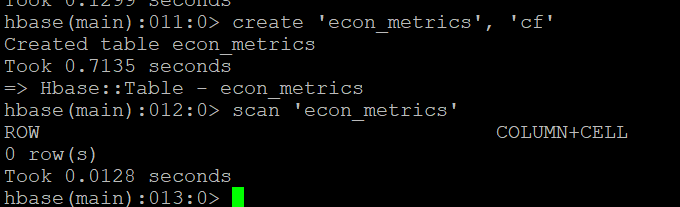
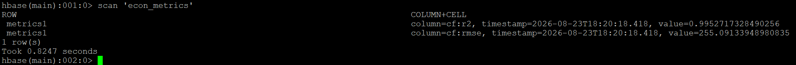

# Apache HBase — Model Metrics Persistence

## Role in the Pipeline

Apache HBase provides the NoSQL persistence layer for the machine learning metrics generated by Spark MLlib.

The HBase table is created before the Spark job runs, verified with an empty scan, populated by the PySpark application, and scanned again after execution to confirm that the model-performance metrics were successfully stored.

## Table Design

**Table name:** `econ_metrics`  
**Row key:** `case_id`  
**Column family/families:** `cf`

The Row key column is 'case_id', it is a unique 3 or 4 digit number.  It is generated from the full list of counties in the US in alphabetical order 'State-County'.  This data only includes 2 states from that data to reduce resource costs.

The column family is 'cf'.  Since this data is relatively small, it is recommended to keep only 1 column family, which I did.

## HBase Commands

The commands used to create and inspect the table are stored in:

[`commands.txt`](commands.txt)

## Empty Table Verification

Explain how the initial empty scan confirms that the target table exists before Spark writes any metrics.

## Metrics Written by Spark

List the model-performance metrics written into HBase.

Examples may include accuracy, precision, recall, F1 score, RMSE, MAE, or another metric appropriate for the selected MLlib algorithm.

Explain how these values represent the output of the Spark machine learning workflow.

## Populated Table Verification

Explain how the final populated scan confirms that Spark successfully wrote the model metrics into HBase.

This final scan provides end-to-end verification that the pipeline successfully moved from ingestion and distributed storage through SQL access, machine learning, and persistent NoSQL results.
