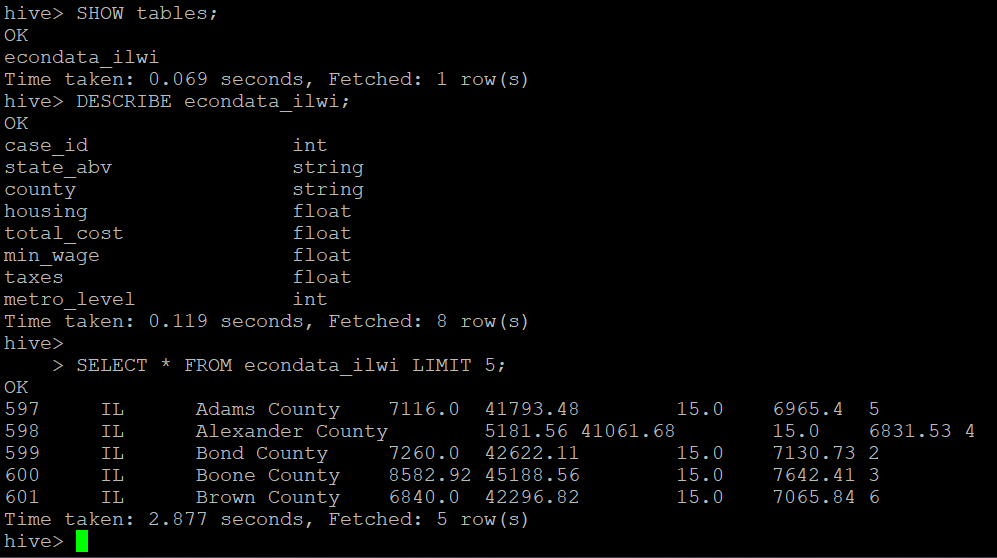
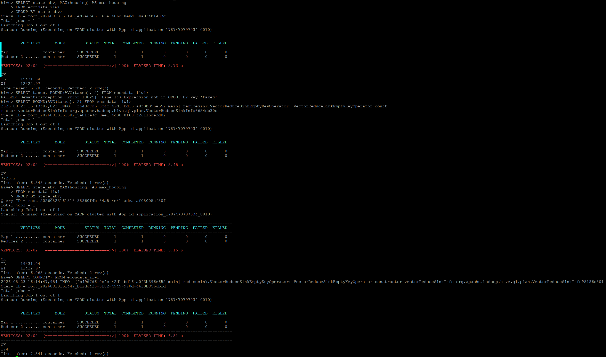

# Apache Hive — Managed Table & SQL Validation

## Role in the Pipeline

Apache Hive provides the structured SQL layer between HDFS storage and the Spark MLlib workload. The project data loaded through NiFi into HDFS is used to create and populate a Hive managed table.

## Hive Table Design

**Table name:** `econdata_ilwi`

The table has 8 columns with 174 entries.  3 of the columns are id columns, 5 of the columns are economic data columns.  For machine learning purposes, 'total_cost' is the target and 'min_wage', 'housing', 'taxes' and 'metro_level' are features

`case_id` INT,

`state_abv` STRING,

`county` STRING,

`housing` FLOAT, - Average cost of housing in the county

`total_cost` FLOAT, - Average cost of living in the county for a single adult.

`min_wage` FLOAT, - The minimum wage of the county

`taxes` FLOAT, - The average taxes paid in the county

`metro_level` INT - The metropolitan level on a scale of 1-6.  Counties scoring 1 are large metropolitan urban centers with big cities, counties scoring 6 are very rural.

## SQL Files

- [`create_tables.sql`](create_tables.sql) — table creation and data-loading SQL
- [`queries.sql`](queries.sql) — validation, exploration, and aggregation queries

## Data Load Verification

Explain how you confirmed that the data was successfully loaded into the managed Hive table.

## Query & Aggregation Verification

Describe the representative queries used to validate the populated table. Include at least one aggregation query and explain what the results demonstrate about the dataset and schema.

The validated Hive table becomes the structured input used by the PySpark MLlib application.
