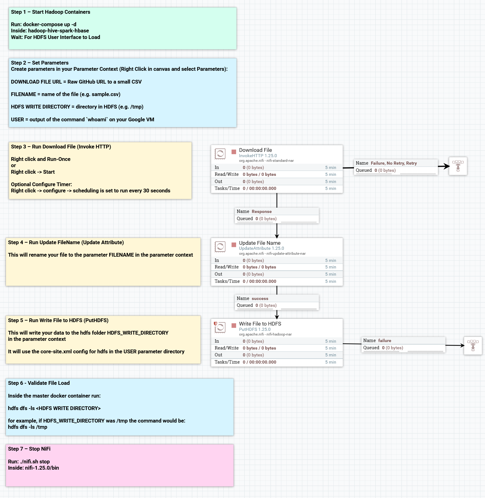
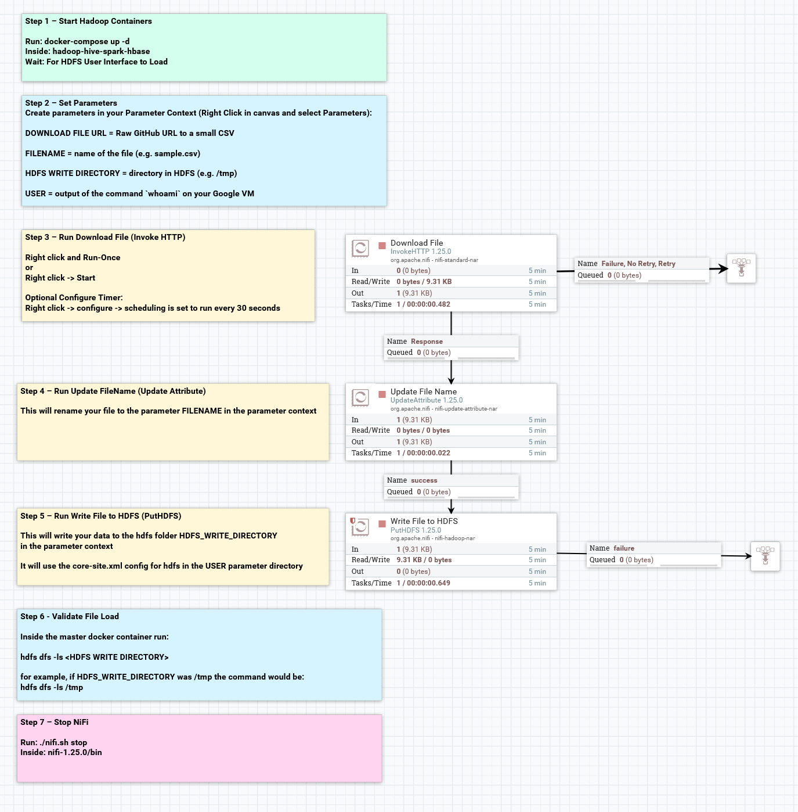

# Apache NiFi — Data Ingestion into HDFS

## Role in the Pipeline

Apache NiFi provides the ingestion and orchestration layer for this project. The completed flow retrieves the project dataset and writes it into HDFS for downstream processing.

## Source Dataset

**Dataset:** [econdata_ilwi.csv]  
**GitHub direct URL:** [https://raw.githubusercontent.com/tm8step/BigData2/refs/heads/main/sample-data/econdata_ilwi.csv]

The data contains economic data for 174 counties across Illinois and Wisconsin.

It has 3 id columns:  'case_id' INT, 'state_abv' STR and 'county' STR
It has 5 economic descriptive indicators, 'housing' FLOAT, 'total_cost' FLOAT, 'min_wage' FLOAT, 'taxes' FLOAT and 'metro_level' INT

## Flow Design

Describe the important processors used in the final NiFi flow and the role each processor performs.

| Processor / Process Group | Role in the Flow |
|---|---|
| [Processor name] | [What it does] |
| [Processor name] | [What it does] |
| [Processor name] | [What it does] |

Explain how data moves from the source URL through NiFi and into HDFS.

## HDFS Destination

**HDFS path:** `[Enter final HDFS path]`

Explain where NiFi writes the dataset and how the destination is used by the next stage of the pipeline.

## Execution Evidence

### Final NiFi Flow

### Running Flow / Queue Activity

### HDFS Ingestion Verification

The HDFS screenshot should show the `hdfs dfs -ls` output confirming that the project dataset was successfully written into HDFS.
