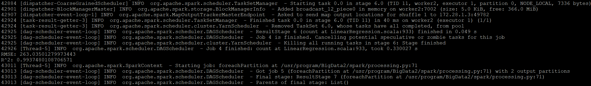
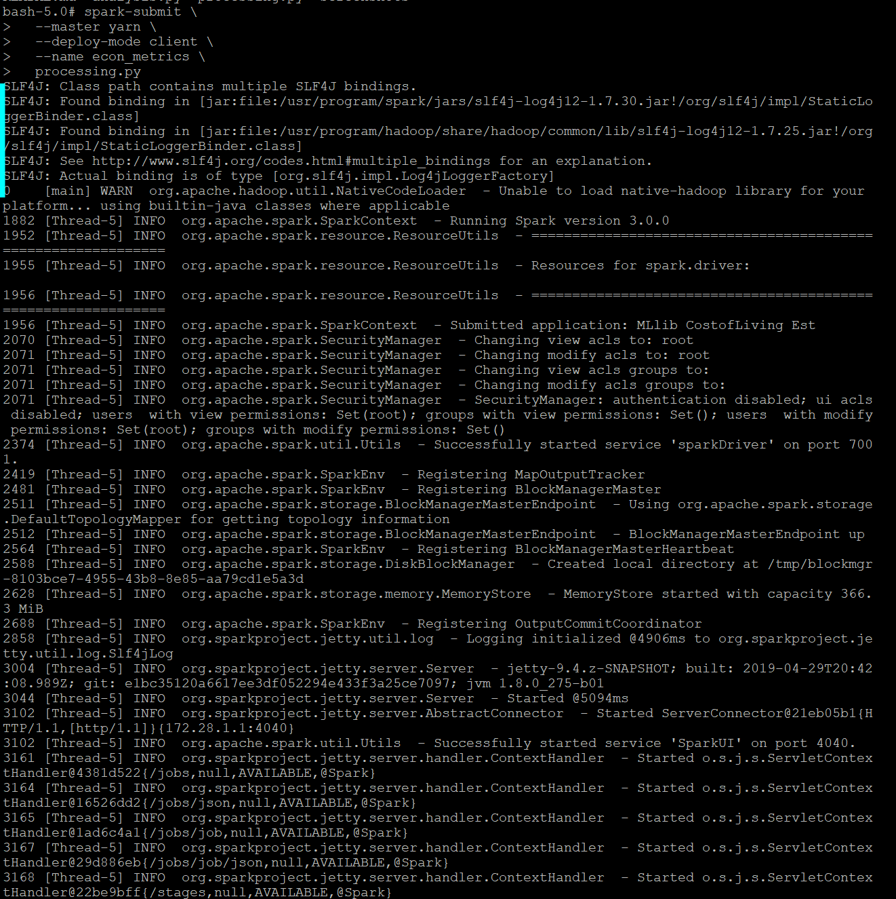
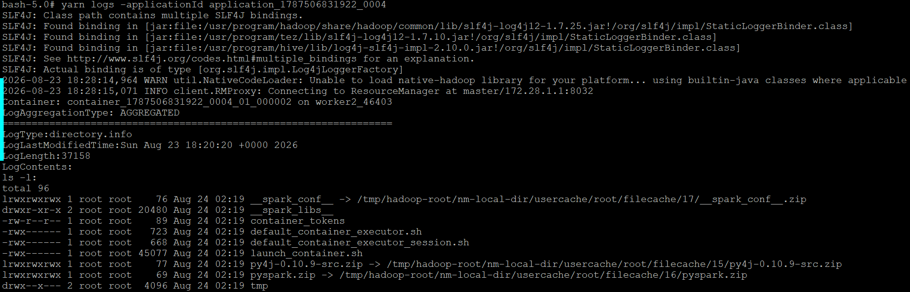

# Apache Spark MLlib — Distributed Machine Learning

## Role in the Pipeline

Apache Spark MLlib provides the distributed processing and machine learning layer for this project. The PySpark application reads project data from Hive, prepares the data for modeling, trains and evaluates a machine learning model, and generates model-performance metrics that are written into HBase.

## Hive Input

**Hive table:** `[Enter Hive table name]`

Explain what data Spark reads from Hive and which fields are used by the machine learning workflow.

## Data Preparation & Transformations

Describe the important preprocessing or transformation steps performed before model training.

Examples may include:

- selecting relevant features;
- handling missing values;
- encoding categorical fields;
- assembling feature vectors;
- scaling or normalization;
- creating training and test datasets.

## MLlib Algorithm

**Algorithm:** `[Enter algorithm]`

Explain:

- why this algorithm was appropriate for the selected dataset;
- what prediction or modeling task it performs;
- which features and target/label are used.

## Training & Evaluation

Summarize the training process and explain the evaluation metric or metrics used.

**Primary evaluation metric(s):** `[Enter metric(s)]`

Explain what the resulting values indicate about model performance.

### Training Output



### Model Evaluation


## Spark Submit / YARN Execution

Document the exact `spark-submit` command used to submit the PySpark application through YARN.

```bash
spark-submit \
  --master yarn \
  --deploy-mode client \
  --name econ_metrics \
  processing.py
```

Briefly describe the successful execution and any important log or output information.



## Spark Log



## HBase Output

List the model-performance metrics written by Spark into HBase and explain how the application connects the machine learning stage to the final persistence layer.

**PySpark source files:** [`processing.py`](processing.py) and/or [`analysis.py`](analysis.py)
